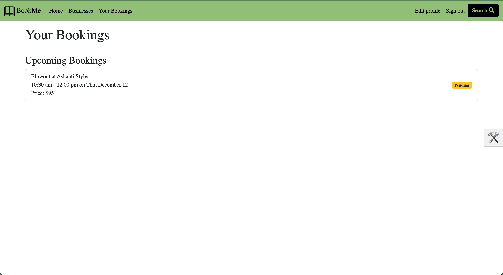

# BookMe

## Description
BookMe is an app where clients can book appointments and service providers (such as hair stylists) can manage their appointments (bookings).

## Table of Contents
- [Features](#features)
- [Installation](#installation)
- [Configuration](#configuration)
- [Usage](#usage)
- [Entity Relationship Diagram](#entity-relationship-diagram)
- [Troubleshooting](#troubleshooting)
- [Contributing](#contributing)
- [Contact](#contact)

## Features
### General
- Search for businesses by name, location, and services.
- Schedule appointments at a business for a specific service.

### Business Owner
- Add business hours and services to a business profile.
- Manage bookings.
  - Add a booking for a specific client.
  - Accept and decline incoming bookings.
  - View a weekly calendar of bookings.

## Installation
### Prerequisites
- Ruby 3.x
- Rails 7.x
- PostgreSQL

### Steps
1. Clone the repository:
`git clone https://github.com/hatcheta1/book-me.git`

2. Install the required gems:
`bundle install`

3. Set up the database:
`rails db:setup`

4. Populate the database:
`rake sample_data`

5. Start the Rails server:
`bin/dev`

## Configuration
There are no configurations at the moment. If you would like to implement something of that nature, please refer to [Rails credentials documentation](https://edgeguides.rubyonrails.org/security.html).

## Usage
1. Start the Rails server:
`bin/dev`

2. Open your browser and navigate to http://localhost:3000

3. Sign up for an account to navigate client-specific views. From there, you can add a business to see the business owner-specific views. Or, log in with one of the following accounts to experience the app without creating an account: 

- Business Owner: `email: ashanti@example.com, password: password`
- Client: `email: leah@example.com, password: password`

4. You can use the search button to search for a business, location (try `Chicago`), or service (try `Haircut`).

5. Create a new booking by going to a business's profile page and clicking the `Book` button beside a service.
  

  After you create the booking, it will show up as `Pending` until the status is updated by the business owner.
  

6. If you are on a business owner page, you can accept or decline an incoming booking.
  

7. As a business owner, you can edit your basic business information, business hours, and services from your profile. You can also use the drop-down menu to navigate to your `Bookings`, `Calendar`, `Services`, and `Business Hours` pages to manage your bookings and edit the aspects of your business there.
  

## Entity Relationship Diagram

## Troubleshooting
### Server not starting
1. Ensure all the required gems are installed: Run `bundle install` in terminal.
2. Verify Ruby version (e.g. Ruby 3.x): Run `ruby -v` in terminal. Install the correct version if needed.
3. Restart the server with `bin/server`.

### Unable to log in
1. Run `rake sample_data` to populate database with seed data.
2. Run `rails console` and query data (e.g. `Business.all` or `Business.count`) to ensure it was seeded correctly.

## Contributing
Contributions are welcome! Please follow these guidelines:

### Steps
1. Fork the repository
2. Create a new branch: `git checkout -b branch_name`
Name the branch using your initials and a brief description (e.g. `ah-add-payment-processing`).
3. Commit your changes (`git commit -m 'Add some feature'`)
4. Push to the branch (`git push origin feature-branch`)
5. Open a pull request

### Coding conventions
- Do not make commits directly to the main branch.
- Make commit messages short and descriptive.
- Adhere to Ruby's coding conventions, including the use of `snake_case` for variable names and `PascalCase` for class names. Refer to the [Ruby Style Guide](https://rubystyle.guide/#underscores-in-numerics) for more information.

### Pull Request Process
- After committing all changes to your branch, create a pull request to the main branch.
- In your repository settings, visit the 'Collaborators' tab and add 'hatcheta1' as a collaborator.
- Visit your pull request, and add 'hatcheta1' a reviewer.
- Leave any concerns or questions in the comments of your pull request.

## Contact
- Your Name - [ahatchett02@gmail.com](mailto:ahatchett02@gmail.com)
- Project Link: [https://github.com/hatcheta1/book-me](https://github.com/hatcheta1/book-me)
